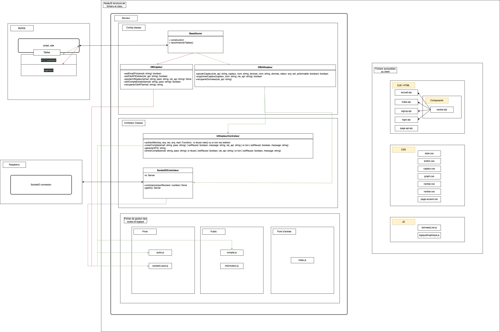

# ProjetADE

---
| :warning: Attention|
|:-----------------------:|
| Ce dépôt GitHub concerne le site du ProjetADE, qui permet de visualiser les données et de contrôler les capteurs.    |
| Pour consulter le code pour le Raspberry Pi, rendez-vous sur le [Projet ADE Client](https://github.com/ArmoMan/ProjetADE-Client). |
---

## Aquaponie
L’aquaponie est un écosystème interdépendant qui combine l’agriculture et la pisciculture. L’eau enrichie par les déchets des poissons, riche en azote, phosphore et potassium, est envoyée vers les plantes, qui utilisent les nutriments présents afin de croître. En chemin, des bactéries transforment les matières organiques en nitrate, ce qui joue un rôle crucial dans l’écosystème. Ces bactéries sont essentiellement un filtre biologique, puisque les déchets des poissons sont toxiques pour eux-mêmes. Donc, après être passée par les plantes, l’eau pourra être retournée vers les poissons. En lien avec l’informatique et les mathématiques, nous serons en mesure d’afficher les données importantes du système d’aquaponie sur un site Web directement relié aux capteurs du module. En consultant des graphiques et des données affichées, cela permettra à l’utilisateur de surveiller le processus de l’aquaponie, de s’assurer que tout va comme prévu et d’agir dès que quelque chose ne semble pas correct.
<div align="center">
  
</div>

## Table des matières
* [Aquaponie](#aquaponie)
* [Projet ADE Client](#projet-ade)
* [Cas d’utilisation](#cas-dutilisation)
* [Guide d’utilisation](#guide-dutilisation)
    * [Option 1: Sur le site ProjetADE](#option-1-sur-le-site-projetade)
    * [Option 2: Héberger vous-même le site](#option-2-héberger-vous-même-le-site)
* [Diagramme des fichiers du NodeJS](#diagramme-des-fichiers-du-nodejs)
* [Installations](#installations)
    * [Installation des bibliothèques](#installation-des-bibliothèques)
        * [Connexion](#connexion)
        * [Infrastructure Web](#infrastructure-web)
        * [Base de données](#base-de-données)
        * [Sécurité et authentification](#sécurité-et-authentification)
        * [Pour le site](#pour-le-site)
        * [Optionnel](#optionnel)

## Projet ADE

Le projet ADE est séparé en deux parties. La première est est ce dépôt, le "Projet ADE", qui permet aux utilisateurs de se connecter à un site pour récupérer une clé API et voir les données des capteurs ainsi que des graphiques analysant les données affichées dedans. Elle permet aussi de contrôler les capteurs (allumer/éteindre).

La deuxième partie est le ProjetADE-Client qui est destiné à la partie "physique du projet". Il permet à n'importe quel utilisateur de connecter les capteurs souhaités (dans le choix des capteurs) à un Raspberry Pi 4 modèle B, d’accéder à une interface graphique et de se connecter au site du Projet ADE en ligne à l'aide d'une clé API.

## Cas d’utilisation 
1. Agriculteurs urbains : Un cultivateur peut installer le système pour surveiller son installation d’aquaponie électroniquement.
2. Écoles et universités : Les étudiants peuvent utiliser le projet pour apprendre les principes de l’aquaponie.
3. Petites fermes et startups agricoles : Elles peuvent adopter le système pour automatiser leurs productions et améliorer leur rendement.
4. Restaurants et chefs cuisiniers : Ils pourraient cultiver des aliments frais directement sur place, réduisant ainsi les coûts de production et de transport. Cela pourrait également améliorer la qualité et la traçabilité des aliments.
5. Communautés et ONG : Elles pourraient utiliser le système dans des projets humanitaires pour assurer la sécurité alimentaire dans des milieux où l’accès à l’eau est limité et améliorer l’autosuffisance des fermes communautaires.

# Guide d’utilisation

Vous avez deux options pour utiliser le site du ProjetADE. La première est d’accéder directement à notre site. La deuxième est d’héberger vous-même ce dépôt.

## Option 1: Sur le site ProjetADE

### Sur le site :
| Étapes | Description|
|---|--------------|
| 1 | Créez un compte.|
| 2 | Récupérez votre clé API en appuyant sur le bouton **Voir clé API**.|

### Sur le Raspberry Pi :
| Étapes | Description|
|---|--------------|
| 3 | Accédez à l’interface sur le Raspberry Pi.|
| 4 | Assurez-vous que dans le code, la connexion se fait à la bonne URL (celle de notre site).|
| 5 | Dans l’interface du Raspberry Pi, collez votre clé API.|
| 6 | Appuyez sur **Commencer**.|

### Sur le site :
| Étapes | Description|
|---|--------------|
| 7 | Appuyez sur le bouton **Regarder Données** pour voir les graphiques et contrôler les données.|

## Option 2: Héberger vous-même le site

### Pour le site :
| Étapes | Description|
|---|--------------|
| 1 | Installez **VSCODE**.|
| 2 | Installez [**NodeJS**](https://nodejs.org/en) sur votre ordinateur.|
| 3 | Clonez ce dépôt GitHub à l’aide de [Git](https://git-scm.com/) sur VSCODE.|
| 4 | Dans le terminal du ProjetADE sur VSCODE, faites les [installations npm nécessaires](#installations).|

### Pour la base de données :

| Étapes | Description|
|---|--------------|
| 5 | Installez la base de données [MySQL](https://www.mysql.com/) sur votre ordinateur.|
| 6 | Créez une base de données et nommez-la ```projet_ade```.|

### Pour le site :
| Étapes | Description|
|-------|------------|
| 7     | Sur le projet dans VSCODE, créez un fichier **.env** et ajoutez les informations suivantes :<br>```DB_HOST="localhost"```<br>```DB_USER="root"```<br>```DB_PASSWORD="dkehgj_d876'"```<br>```DB_NAME="projet_ade"```<br> |
| 8 | Lancez le serveur avec `npm start` et accédez au site.|
| 9 | Suivez les étapes de la section [Sur le site ProjetADE](#sur-le-site-projetade).|
| 10 | Voilà !|

> [!NOTE]  
> La clé API va être passée dans l'URL, car autrement cela crée des conflits avec Cloudflare et Nginx.  
>
> Si vous hébergez vous-même et que le code retourne une erreur liée à la connexion Socket.IO ou à une clé API indéfinie, vous pouvez utiliser dans `socketio-controleur.js` :  
> `const cleApi = socket.handshake.headers['cle_api'];`  
> 
> Dans ce cas, il faut également modifier le code de ProjetADE-Client, dans le fichier `socketio_client.py`, et utiliser :  
> `self.sio.connect(self.__lien, headers={"cle_api": self.__cle_api})`.

## Diagramme des fichiers du NodeJS 
Pour plus de détails à propos de ce diagramme, consultez notre documentation Word.


## Installations
---
| :warning: Attention                              |
|:-----------------------------------------------:|
| La section suivante concerne les installations à effectuer avec npm sur vscode.   |
---

## Installation des bibliothèques

### Connexion

#### socket.io 
```
npm install socket.io
```
Cette [librairie](https://socket.io/docs/v4/server-installation/) permet de gérer la communication en temps réel entre le serveur et les clients (protocole Socket.IO). Dans notre projet, elle est utilisée pour connecter un client à une "room" correspondant à sa clé API, ce qui permet d’échanger des données personnalisées en direct.

---

### Infrastructure Web

#### ExpressJS
```
npm install express
```
[Express](https://www.npmjs.com/package/express) simplifie la gestion des routes et le traitement des requêtes/réponses. Par exemple, lorsqu’un utilisateur visite le site `site.com/page1`, Express lui renvoie la page HTML correspondante.

---

### Base de données

#### mysql2
```
npm install --save mysql2
```
[mysql2](https://sidorares.github.io/node-mysql2/docs) est une bibliothèque permettant de se connecter à une base de données MySQL et d’exécuter des requêtes (ajout, suppression, mise à jour, etc.). Elle est utilisée pour enregistrer les données des utilisateurs et des capteurs.

---

### Sécurité et authentification

#### dotenv
```
npm install dotenv
```
Cette [bibliothèque](https://www.npmjs.com/package/dotenv) permet de stocker localement des informations sensibles, comme les identifiants de connexion à la base de données. Ainsi, elles ne sont pas partagées lors d’un commit Git.

#### bcrypt
```
npm install bcrypt
```
[bcrypt](https://www.npmjs.com/package/bcrypt) est utilisée pour le hachage des mots de passe. Elle permet de protéger les mots de passe enregistrés en base de données en évitant leur stockage en texte clair.

#### generate-api-key
```
npm install generate-api-key
```
Cette [librairie](https://www.npmjs.com/package/generate-api-key) permet de générer des clés API aléatoires et uniques pour identifier chaque utilisateur de manière sécurisée.

#### express-session
```
npm install express-session
```
[express-session](https://www.npmjs.com/package/express-session) permet de gérer les sessions utilisateurs. Elle conserve les informations de connexion (comme l’email et la clé API) entre les requêtes, ce qui évite à l’utilisateur de se reconnecter à chaque page.

---

### Pour le site

#### EJS
```
npm install ejs
```
[EJS](https://ejs.co/) est un moteur de templates HTML permettant d’injecter du JavaScript dans le code HTML. Il permet d’afficher des données dynamiques selon l’utilisateur (ex. : barre de navigation personnalisée) et d’éviter la répétition de code grâce à des fichiers partagés.

#### Chart.js
```
Aucune installation nécessaire : la bibliothèque est importée directement via une API dans le code front-end.
```
Cette bibliothèque est utilisée pour afficher des graphiques dans les pages HTML.

---

### Optionnel

#### node-cron
```
npm i node-cron
```
Cette [bibliothèque](https://www.npmjs.com/package/node-cron) permet d'exécuter une tâche à intervalles réguliers sans bloquer entièrement le code, contrairement à l'utilisation de sleep(). Elle est idéale pour automatiser des commandes répétitives, comme la récupération des données des appareils connectés toutes les x minutes. Cette bibliothèque est optionnelle et n’est pas utilisée dans notre projet actuel, car la seule tâche requise est d’appeler une méthode toutes les 10 minutes, ce qui est facilement réalisable avec setInterval(). Ajouter node-cron alourdirait inutilement le projet. Toutefois, si une exécution à une heure précise devient nécessaire dans le futur, cette technologie pourrait alors être envisagée.
